<h1 align="center">Yug Kansagara</h1>

<p align="center">
  <b>Full-Stack Developer • AI Applications • Modern Web Development</b>
</p>

<p align="center">
  
</p>

<p align="center">
  <a href="https://yugprotfolio.vercel.app">Portfolio</a> •
  <a href="mailto:yugkanasagara@gmail.com">Email</a> •
  <a href="https://github.com/Yugpatel009">GitHub</a>
</p>

---

<table>
<tr>

<td width="38%" align="center">



</td>

<td width="62%">

```text
yug@github:~$ neofetch

──────────────────────────────────

Name        Yug Kansagara
Username    Yugpatel009

Role        Full-Stack Developer

Focus
• AI Applications
• Developer Tools
• Modern Web Apps

Currently
• DRAKON AI
• College ERP

Frontend
• React
• Flutter
• Tailwind CSS

Backend
• Python
• Flask
• ASP.NET

Database
• SQL Server
• Firebase

Editor
• VS Code

Location
• Gujarat, India
```

</td>

</tr>
</table>

---

## whoami

I'm a full-stack developer who enjoys building AI-powered applications, developer tools, and modern web experiences.

Currently exploring local LLMs, automation, and scalable backend systems.

---

## tree ~/projects

```text
projects
│
├── 🤖 DRAKON AI
│   ├── AI Chat
│   ├── Local LLM
│   └── Ollama
│
├── 🎓 College ERP
│   ├── ASP.NET
│   ├── SQL Server
│   └── Dashboard
│
└── 🌐 Portfolio
    ├── React
    └── Tailwind CSS
```

---

## Tech Stack

<p align="center">


</p>

---

## GitHub Statistics

<p align="center">


</p>

<p align="center">


</p>

---

## Activity

> GitHub already shows my yearly contribution calendar below the profile.

<p align="center">


</p>

---

## Connect

<p align="center">

<a href="mailto:yugkanasagara@gmail.com">

</a>

<a href="https://yugprotfolio.vercel.app">

</a>

<a href="https://github.com/Yugpatel009">

</a>

</p>

---

<p align="center">
<i>Build software that solves real problems.</i>
</p>
